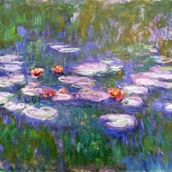
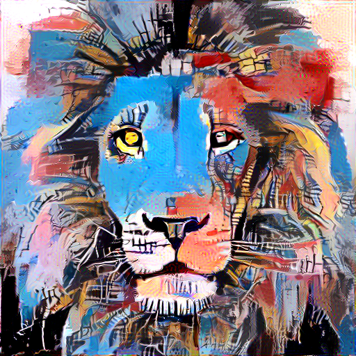
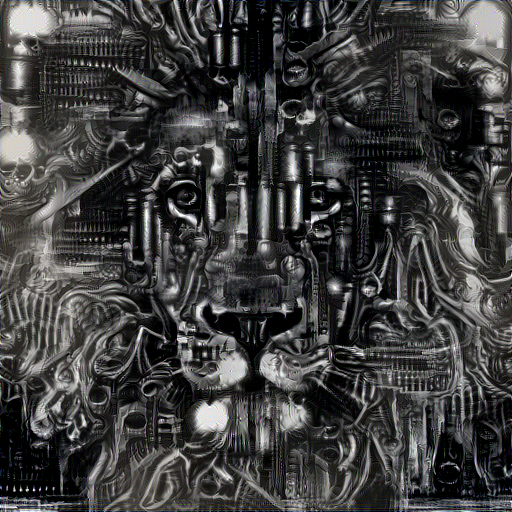
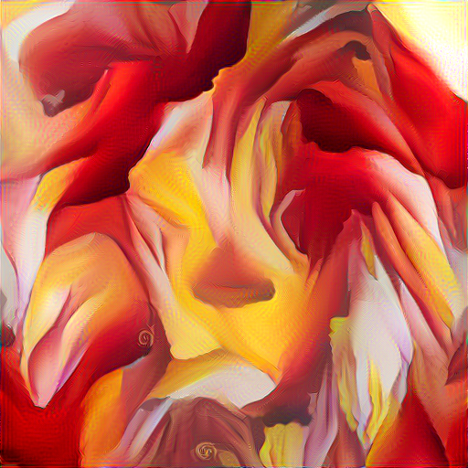
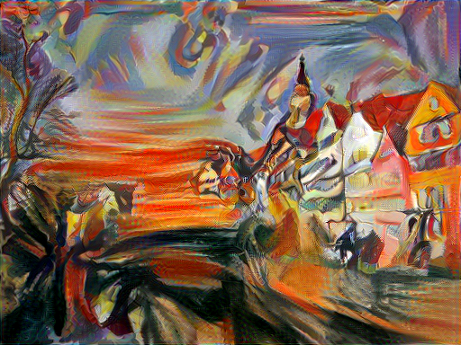
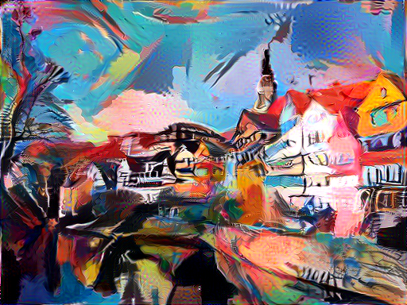

## TensorDeepArtify

Welcome to TensorDeepArtify

this TensorFlow project, draws inspiration from 3 Research papers in the field of deep learning and computer vision links to these research papers are mentioned below.

this tensorflow implementation is based on this three comprehensive techniques:

1. Artistic Style Transfer for Videos: The foundation for this technique comes from a paper that once seemed like science fiction but is now a reality. The paper titled "Artistic Style Transfer for Videos" showcases how deep learning can transfer artistic styles from images to entire video sequences. It leverages recent advancements in style transfer for still images and introduces novel initializations and loss functions tailored to videos. This enables the creation of consistent and stable stylized videos, even in scenarios with substantial motion and occlusion.

2. Image Style Transfer using Convolutional Neural Networks: This technique draws its inspiration from a paper titled "Image Style Transfer Using Convolutional Neural Networks." The paper demonstrates how feature representations from powerful Convolutional Neural Networks (CNNs) can be harnessed to transfer the artistic style between arbitrary images. Although there are technical challenges, such as resolution limitations and computational demands, this approach delivers high perceptual quality in stylized images.

3. Preserving Color in Neural Artistic Style Transfer:Building upon the neural artistic style transfer algorithm described in the paper by Gatys and colleagues, my project addresses a potential shortcoming. While the original algorithm excels at transferring styles, it can inadvertently alter the colors in the scene. This extension introduces simple yet effective linear methods for transferring style while preserving the original colors of the content image

Feel free to dive into the code, experiment with different styles and segmentation tasks, and share your stylized creations. I  hope this project continues to inspire and serve as a valuable resource for the deep learning community.

This is a TensorFlow implementation of several techniques described in the papers: 
* [Image Style Transfer Using Convolutional Neural Networks](http://www.cv-foundation.org/openaccess/content_cvpr_2016/papers/Gatys_Image_Style_Transfer_CVPR_2016_paper.pdf)
by Leon A. Gatys, Alexander S. Ecker, Matthias Bethge
* [Artistic style transfer for videos](https://arxiv.org/abs/1604.08610)
by Manuel Ruder, Alexey Dosovitskiy, Thomas Brox
* [Preserving Color in Neural Artistic Style Transfer](https://arxiv.org/abs/1606.05897)
by Leon A. Gatys, Matthias Bethge, Aaron Hertzmann, Eli Shechtman  

Additionally, techniques are presented for semantic segmentation and multiple style transfer.

The Neural Style algorithm synthesizes a [pastiche](https://en.wikipedia.org/wiki/Pastiche) by separating and combining the content of one image with the style of another image using convolutional neural networks (CNN). Below is an example of transferring the artistic style of [The Starry Night](https://en.wikipedia.org/wiki/The_Starry_Night) onto a photograph of an African lion:

<p align="center">


</p>

Transferring the style of various artworks to the same content image produces qualitatively convincing results:
<p align="center">






  




</p>

Here I reproduce Figure 3 from the first paper, which renders a photograph of the Neckarfront in Tübingen, Germany in the style of 5 different iconic paintings [The Shipwreck of the Minotaur](http://www.artble.com/artists/joseph_mallord_william_turner/paintings/the_shipwreck_of_the_minotaur), [The Starry Night](https://www.wikiart.org/en/vincent-van-gogh/the-starry-night-1889), [Composition VII](https://www.wikiart.org/en/wassily-kandinsky/composition-vii-1913), [The Scream](https://www.wikiart.org/en/edvard-munch/the-scream-1893), [Seated Nude](http://www.pablopicasso.org/seated-nude.jsp):
<p align="center">


</p>

### Content / Style Tradeoff
The relative weight of the style and content can be controlled.

Here I render with an increasing style weight applied to [Red Canna](http://www.georgiaokeeffe.net/red-canna.jsp):
<p align="center">



</p>

### Multiple Style Images
More than one style image can be used to blend multiple artistic styles.

<p align="center">


  



</p>

*Top row (left to right)*: [The Starry Night](https://www.wikiart.org/en/vincent-van-gogh/the-starry-night-1889) + [The Scream](https://www.wikiart.org/en/edvard-munch/the-scream-1893), [The Scream](https://www.wikiart.org/en/edvard-munch/the-scream-1893) + [Composition VII](https://www.wikiart.org/en/wassily-kandinsky/composition-vii-1913), [Seated Nude](http://www.pablopicasso.org/seated-nude.jsp) + [Composition VII](https://www.wikiart.org/en/wassily-kandinsky/composition-vii-1913)  
*Bottom row (left to right)*: [Seated Nude](http://www.pablopicasso.org/seated-nude.jsp) + [The Starry Night](https://www.wikiart.org/en/vincent-van-gogh/the-starry-night-1889), [Oversoul](http://alexgrey.com/art/paintings/soul/oversoul/) + [Freshness of Cold](https://afremov.com/FRESHNESS-OF-COLD-PALETTE-KNIFE-Oil-Painting-On-Canvas-By-Leonid-Afremov-Size-30-x40.html), [David Bowie](http://www.francoise-nielly.com/index.php/galerie/index/56) + [Skull](https://www.wikiart.org/en/jean-michel-basquiat/head) 

### Style Interpolation
When using multiple style images, the degree of blending between the images can be controlled.

<p align="center">


</p>

*Top row (left to right)*: content image, .2 [The Starry Night](https://www.wikiart.org/en/vincent-van-gogh/the-starry-night-1889) + .8 [The Scream](https://www.wikiart.org/en/edvard-munch/the-scream-1893), .8 [The Starry Night](https://www.wikiart.org/en/vincent-van-gogh/the-starry-night-1889) + .2 [The Scream](https://www.wikiart.org/en/edvard-munch/the-scream-1893)  
*Bottom row (left to right)*: .2 [Oversoul](http://alexgrey.com/art/paintings/soul/oversoul/) + .8 [Freshness of Cold](https://afremov.com/FRESHNESS-OF-COLD-PALETTE-KNIFE-Oil-Painting-On-Canvas-By-Leonid-Afremov-Size-30-x40.html), .5 [Oversoul](http://alexgrey.com/art/paintings/soul/oversoul/) + .5 [Freshness of Cold](https://afremov.com/FRESHNESS-OF-COLD-PALETTE-KNIFE-Oil-Painting-On-Canvas-By-Leonid-Afremov-Size-30-x40.html), .8 [Oversoul](http://alexgrey.com/art/paintings/soul/oversoul/) + .2 [Freshness of Cold](https://afremov.com/FRESHNESS-OF-COLD-PALETTE-KNIFE-Oil-Painting-On-Canvas-By-Leonid-Afremov-Size-30-x40.html)

### Video
Animations can be rendered by applying the algorithm to each source frame.  For the best results, the gradient descent is initialized with the previously stylized frame warped to the current frame according to the optical flow between the pair of frames.  Loss functions for temporal consistency are used to penalize pixels excluding disoccluded regions and motion boundaries.

#### video implementations: 


<p align="center">


<br>


</p>  

*Top row (left to right)*: source frames, ground-truth optical flow visualized      
*Bottom row (left to right)*: disoccluded regions and motion boundaries, stylized frames


### Gradient Descent Initialization
The initialization of the gradient descent is controlled using `--init_img_type` for single images and `--init_frame_type` or `--first_frame_type` for video frames.  White noise allows an arbitrary number of distinct images to be generated.  Whereas, initializing with a fixed image always converges to the same output.

Here I reproduce Figure 6 from the first paper:
<p align="center">


</p>

*Top row (left to right)*: Initialized with the content image, the style image, white noise (RNG seed 1)  
*Bottom row (left to right)*: Initialized with white noise (RNG seeds 2, 3, 4)

### Layer Representations
The feature complexities and receptive field sizes increase down the CNN heirarchy.

Here I reproduce Figure 3 from [the original paper](https://arxiv.org/abs/1508.06576):
<table align='center'>
<tr align='center'>
<td></td>
<td>1 x 10^-5</td>
<td>1 x 10^-4</td>
<td>1 x 10^-3</td>
<td>1 x 10^-2</td>
</tr>
<tr>
<td>conv1_1</td>
<td></td>
<td></td>
<td></td>
<td></td>
</tr>
<tr>
<td>conv2_1</td>
<td></td>
<td></td>
<td></td>
<td></td>
</tr>
<tr>
<td>conv3_1</td>
<td></td>
<td></td>
<td></td>
<td></td>
</tr>
<tr>
<td>conv4_1</td>
<td></td>
<td></td>
<td></td>
<td></td>
</tr>
<tr>
<td>conv5_1</td>
<td></td>
<td></td>
<td></td>
<td></td>
</tr>
</table>

*Rows*: increasing subsets of CNN layers; i.e. 'conv4_1' means using 'conv1_1', 'conv2_1', 'conv3_1', 'conv4_1'.   
*Columns*: alpha/beta ratio of the the content and style reconstruction (see Content / Style Tradeoff).

## Setup
#### Dependencies:
* [tensorflow](https://github.com/tensorflow/tensorflow)
* [opencv](http://opencv.org/downloads.html)

#### Optional (but recommended) dependencies:
* [CUDA](https://developer.nvidia.com/cuda-downloads) 7.5+
* [cuDNN](https://developer.nvidia.com/cudnn) 5.0+

#### After installing the dependencies: 
* Download the [VGG-19 model weights](http://www.vlfeat.org/matconvnet/pretrained/) (see the "VGG-VD models from the *Very Deep Convolutional Networks for Large-Scale Visual Recognition* project" section). More info about the VGG-19 network can be found [here](http://www.robots.ox.ac.uk/~vgg/research/very_deep/).
* After downloading, copy the weights file `imagenet-vgg-verydeep-19.mat` to the project directory.

## Usage
### Basic Usage

#### Single Image
1. Copy 1 content image to the default image content directory `./image_input`
2. Copy 1 or more style images to the default style directory `./styles`
3. Run the command:
```
bash stylize_image.sh <path_to_content_image> <path_to_style_image>
```
*Example*:
```
bash stylize_image.sh ./image_input/lion.jpg ./styles/kandinsky.jpg
```
*Note*: Supported image formats include: `.png`, `.jpg`, `.ppm`, `.pgm`

*Note*: Paths to images should not contain the `~` character to represent your home directory; you should instead use a relative path or the absolute path.

#### Video Frames
1. Copy 1 content video to the default video content directory `./video_input`
2. Copy 1 or more style images to the default style directory `./styles`
3. Run the command:
```
bash stylize_video.sh <path_to_video> <path_to_style_image>
```
*Example*:
```
bash stylize_video.sh ./video_input/video.mp4 ./styles/kandinsky.jpg
```

*Note*: Supported video formats include: `.mp4`, `.mov`, `.mkv`

### Advanced Usage
#### Single Image or Video Frames
1. Copy content images to the default image content directory `./image_input` or copy video frames to the default video content directory `./video_input`  
2. Copy 1 or more style images to the default style directory `./styles`  
3. Run the command with specific arguments:
```
python neural_style.py <arguments>
```
*Example (Single Image)*:
```
python neural_style.py --content_img golden_gate.jpg \
                       --style_imgs starry-night.jpg \
                       --max_size 1000 \
                       --max_iterations 100 \
                       --original_colors \
                       --device /cpu:0 \
                       --verbose;
```

To use multiple style images, pass a *space-separated* list of the image names and image weights like this:

`--style_imgs starry_night.jpg the_scream.jpg --style_imgs_weights 0.5 0.5`

*Example (Video Frames)*:
```
python neural_style.py --video \
                       --video_input_dir ./video_input/my_video_frames \
                       --style_imgs starry-night.jpg \
                       --content_weight 5 \
                       --style_weight 1000 \
                       --temporal_weight 1000 \
                       --start_frame 1 \
                       --end_frame 50 \
                       --max_size 1024 \
                       --first_frame_iterations 3000 \
                       --verbose;
```
*Note*:  When using `--init_frame_type prev_warp` you must have previously computed the backward and forward optical flow between the frames.  See `./video_input/make-opt-flow.sh` and `./video_input/run-deepflow.sh`

## Memory
By default, `neural-style-tf` uses the NVIDIA cuDNN GPU backend for convolutions and L-BFGS for optimization.
These produce better and faster results, but can consume a lot of memory. You can reduce memory usage with the following:

* **Use Adam**: Add the flag `--optimizer adam` to use Adam instead of L-BFGS. This should significantly
  reduce memory usage, but will require tuning of other parameters for good results; in particular you should
  experiment with different values of `--learning_rate`, `--content_weight`, `--style_weight`
* **Reduce image size**: You can reduce the size of the generated image with the `--max_size` argument.

## Implementation Details
All images were rendered on a machine with:
* **CPU:** Intel Core i7-6800K @ 3.40GHz × 12 
* **GPU:** NVIDIA GeForce GTX 1080/PCIe/SSE2
* **OS:** Linux Ubuntu 16.04.1 LTS 64-bit
* **CUDA:** 8.0
* **python:** 2.7.12
* **tensorflow:** 0.10.0rc
* **opencv:** 2.4.9.1

## Source:

Source video frames were obtained from:
* [MPI Sintel Flow Dataset](http://sintel.is.tue.mpg.de/)


